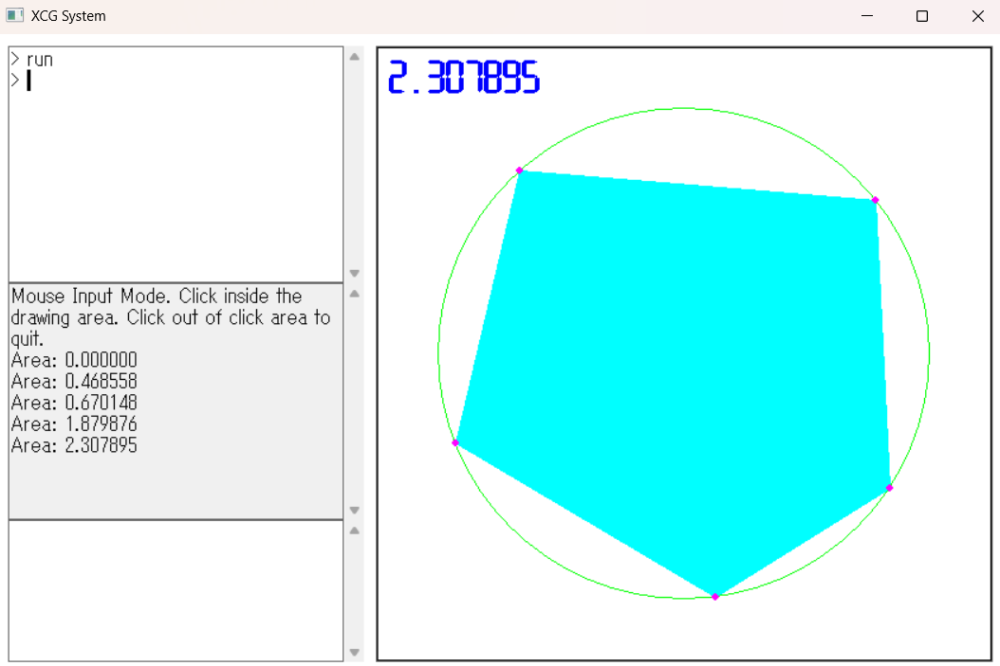
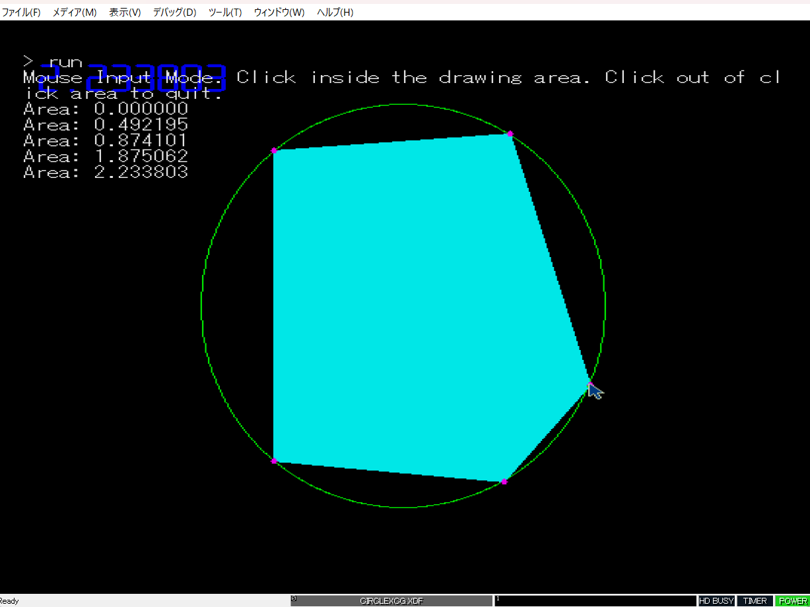

# CircleXCG

円の面積の近似値を計算することができます。

## 概要

- 円に内接する多角形の頂点を追加していくことにより、円の面積に近づけていくことができるプログラムです。
- C++ で書かれています。
- コンパイル時に切り替えることにより、Windows と X68000 で動作させることができます。
- Windows 用は Visual Studio のプロジェクトになっています。
- X68000 用は make を実行してください。

---

## 対応プラットフォーム

| プラットフォーム | 状態               | 詳細                                 |
|------------------|--------------------|--------------------------------------|
| Windows          | 対応             | Visual Studio プロジェクト      |
| X68000           | 対応  | make でコンパイル可能  |

---

## 使用方法

### Windows でのコンパイル方法

- Windows 用は Visual Studio のプロジェクトになっています。プロジェクトを開いてビルドしてください。

### X68000 でのコンパイル方法

- X68000 用は make を実行してください。
  - X68000 エミュレーター [XM6 TypeG](http://retropc.net/pi/xm6/index.html)で動作させることができます。
  - Windows で [MSYS2](https://www.msys2.org/)上で C++ クロスコンパイラ[elf2x68k](https://github.com/yunkya2/elf2x68k)でコンパイルできます。
  - CirclXCG.x が作られます。これを editdisk でフロッピーディスクのイメージにして X68000 エミュレーター [XM6 TypeG](http://retropc.net/pi/xm6/index.html)で読み込んで実行してください。

## プログラムの使い方

このプログラムは[円の面積](https://hikakankan.github.io/CircleJS/)にコマンドを受け付ける機能を追加したものです。最初はコマンドを受け付けるモードになっています。コマンドは以下のようになります。
- add 角度
  - 角度(度)に位置に点を追加します。
- div 分割数
  - 点の間を指定した個数に分割して点を追加します。
- exit
  - 終了します。
- run
  - マウス入力を受け付けるようになります。マウス入力領域外をクリックするとマウス入力モードを終了します。(X68000 版では「q」キーを押してもマウス入力モードを終了します)
  - XM6 でマウス入力を受け付けるようにするには F12 キーを押してマウスモードを変更してください。

Windows では以下のように表示されます。

- 左上のウィンドウは入力ウィンドウで、ここにコマンドを入力します。
- 左中段のウィンドウは出力ウィドウです。コマンドの出力が表示されます。
- 左下のウィンドウは使いません。
- 右側のウィンドウはグラフィックスウィンドウです。画像が表示されます。

X68000 では以下のように表示されます。

- テキスト画面とグラフィックス画面が重なって表示されます。
- テキスト画面にはコマンドの入出力が表示されます。
- グラフィックス画面には画像が表示されます。

最初は円が表示されています。 この円の半径は1とします。 円周上をクリックするとそこに点を描くことができます。 3点以上を描くと、その点を頂点とする多角形が描画されて、 その多角形の面積が表示されます。 点を増やしていくと、多角形の面積は円の面積に近づいていきます。

---

## ライセンス

このプロジェクトは MIT ライセンスのもとで公開されています。

